# @deepseek-ai/dsh-client-ui-glass

DSH Web 客户端的可开关暗色玻璃皮肤：装为 DSH 本地插件即可生效，随时开关，卸载即复原。

A toggleable dark-glass skin for the DSH Web client.

[中文](#中文) · [English](#english)

## 中文

### 截图

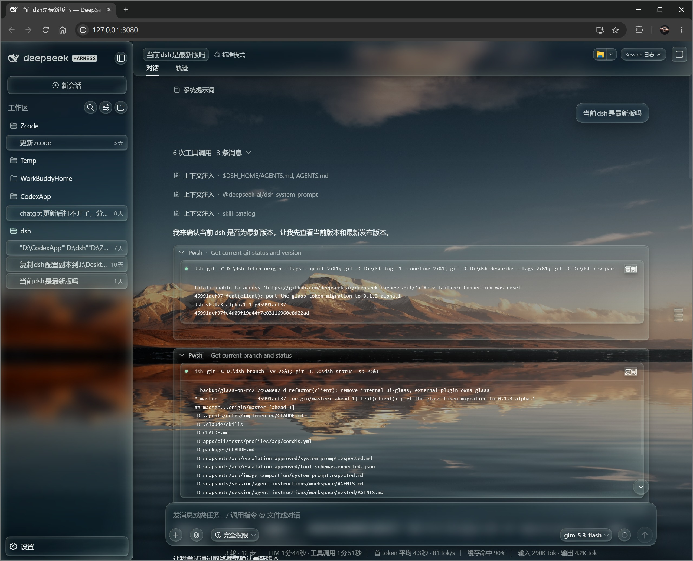
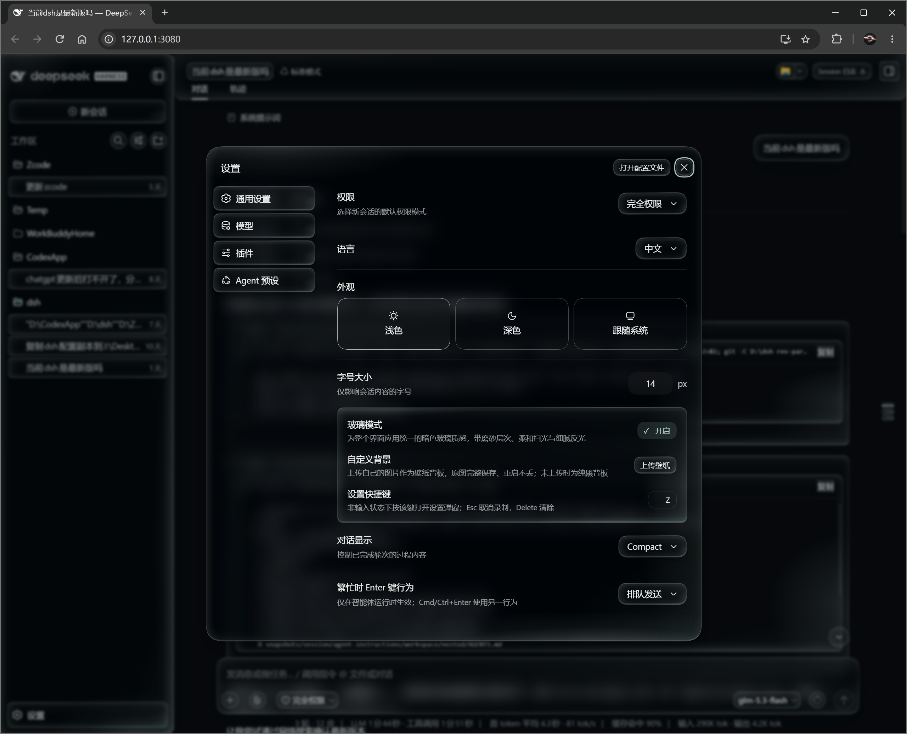

| | | |
|---|---|---|
| 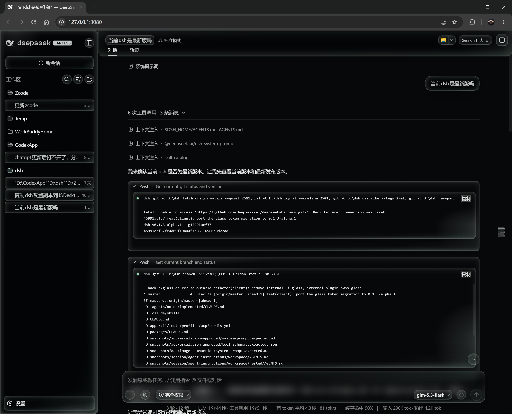 | 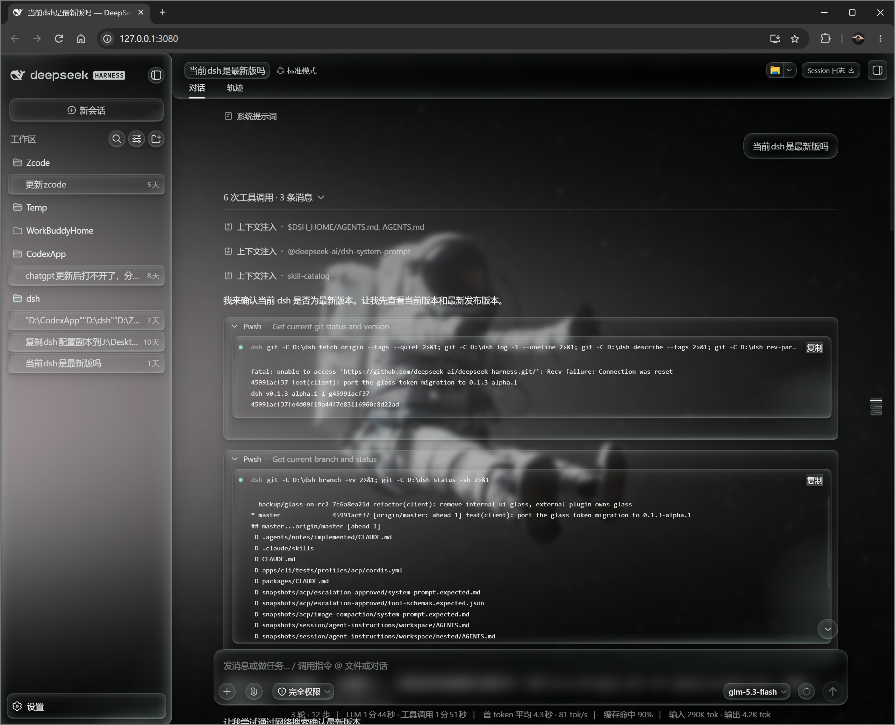 | 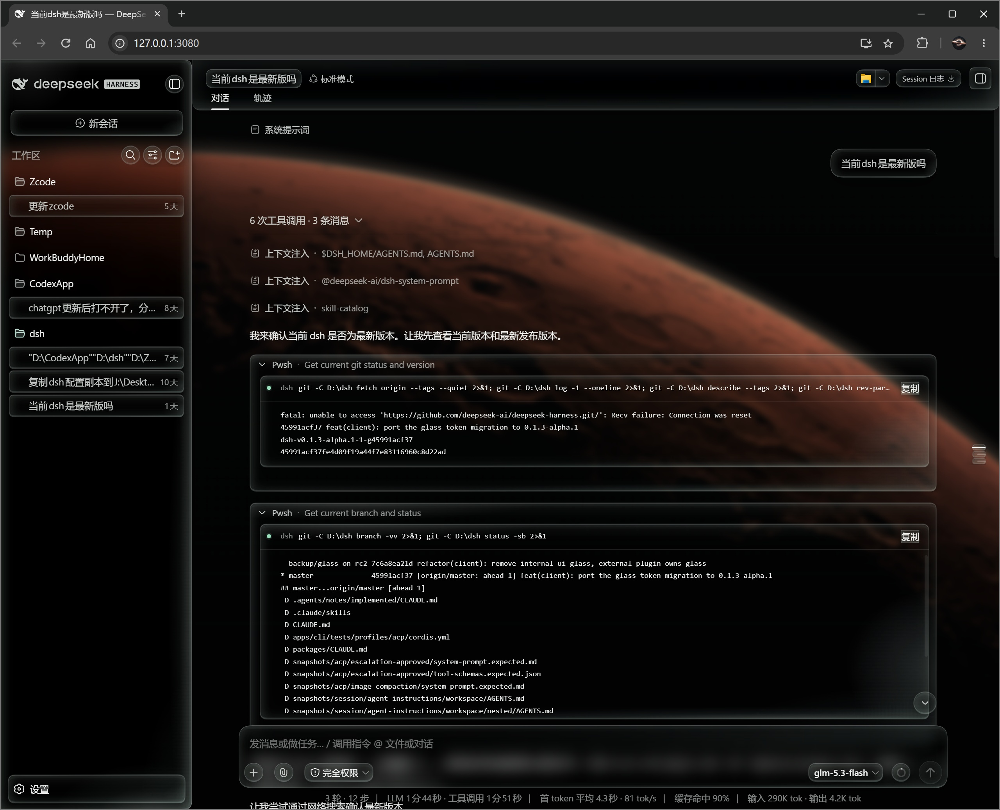 |
| 纯黑背板 | 灰调壁纸 | 火星壁纸 |
| 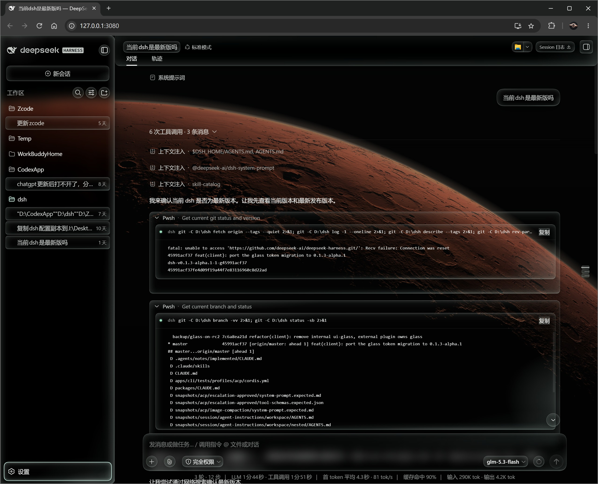 | 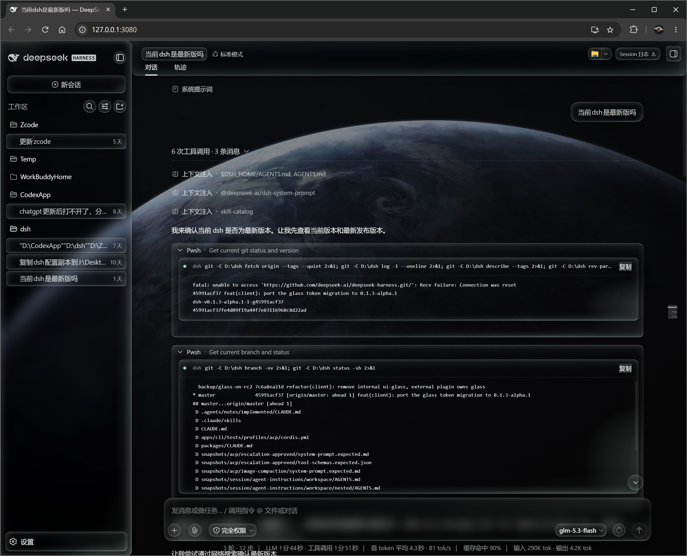 | 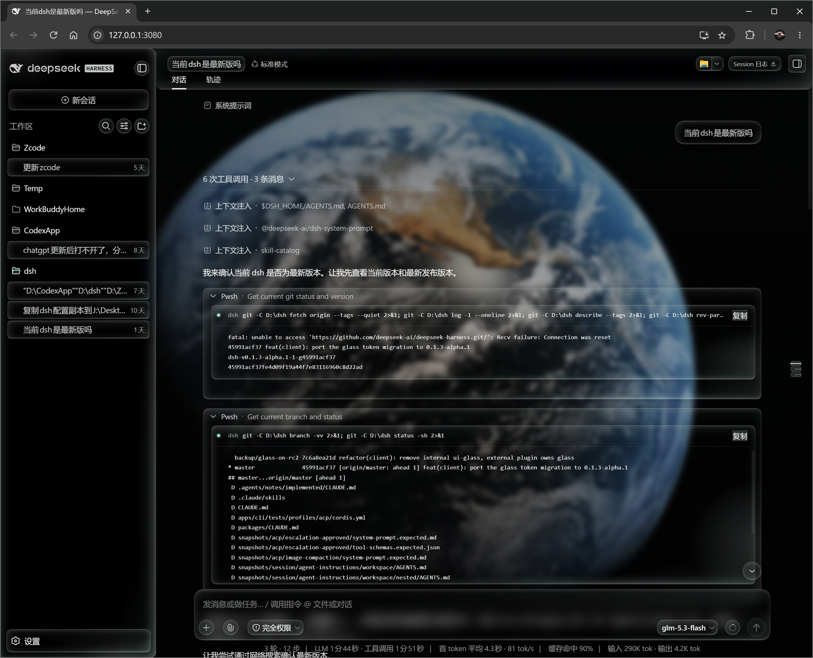 |
| 火星 · 亮 | 地球 | 地球 · 近景 |
| 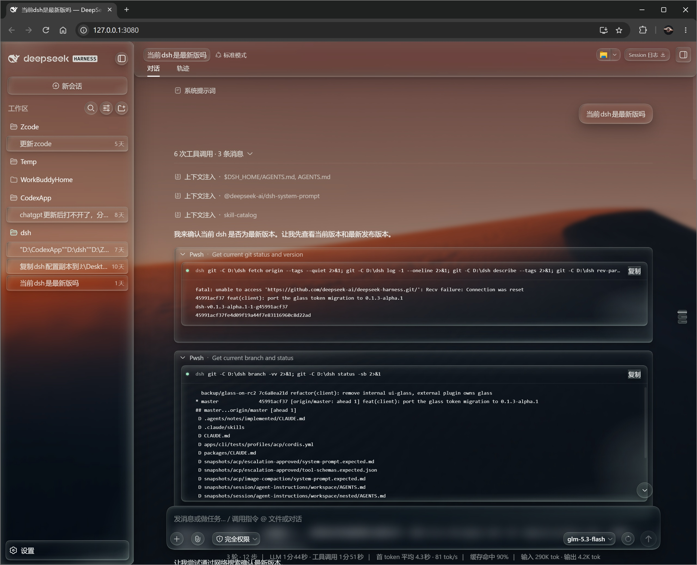 | 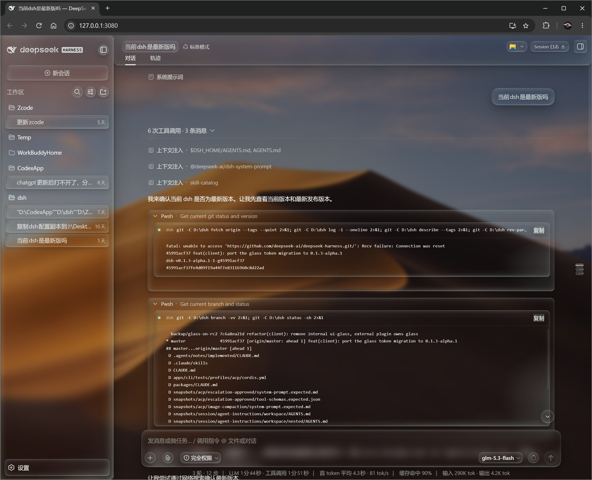 | 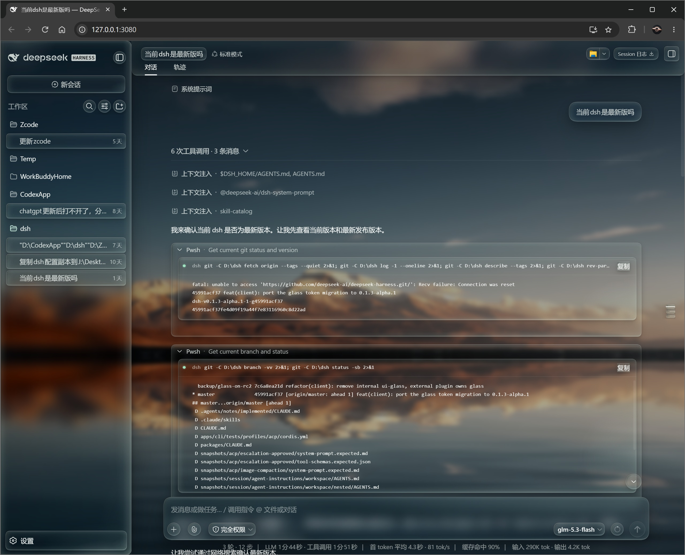 |
| 沙丘 | 群山 | 湖畔倒影 |

### 安装（DSH 本地插件）

```powershell
git clone https://github.com/wen-yifeng/dsh-client-ui-glass.git "<dsh-root>\.dsh\plugins\@deepseek-ai\dsh-client-ui-glass"
New-Item -ItemType Junction -Path '<dsh-root>\.dsh\profiles\node_modules\@deepseek-ai\dsh-client-ui-glass' -Target '<dsh-root>\.dsh\plugins\@deepseek-ai\dsh-client-ui-glass'
# 在 <dsh-root>\.dsh\profiles\web\cordis.patch.yml 追加：
# - insert:
#     - id: ui-glass
#       name: '@deepseek-ai/dsh-client-ui-glass'
```

重启 DSH Web。开关在 设置 → 通用设置 → 玻璃模式。

### 构建

```sh
node <dsh-root>/node_modules/tsdown/dist/run.mjs   # 在本目录执行
```

---

## English

### Screenshots


| | | |
|---|---|---|
|  |  |  |
| Black stage | Gray wallpaper | Mars wallpaper |
|  |  |  |
| Mars, bright | Earth | Earth, close-up |
|  |  |  |
| Dunes | Mountains | Lake reflection |

### Install (DSH local plugin)

```powershell
git clone https://github.com/wen-yifeng/dsh-client-ui-glass.git "<dsh-root>\.dsh\plugins\@deepseek-ai\dsh-client-ui-glass"
New-Item -ItemType Junction -Path '<dsh-root>\.dsh\profiles\node_modules\@deepseek-ai\dsh-client-ui-glass' -Target '<dsh-root>\.dsh\plugins\@deepseek-ai\dsh-client-ui-glass'
# Add to <dsh-root>\.dsh\profiles\web\cordis.patch.yml:
# - insert:
#     - id: ui-glass
#       name: '@deepseek-ai/dsh-client-ui-glass'
```

Restart DSH Web. Toggle in Settings > General > 玻璃模式 (Glass mode).

### Build

```sh
node <dsh-root>/node_modules/tsdown/dist/run.mjs   # from this directory
```
