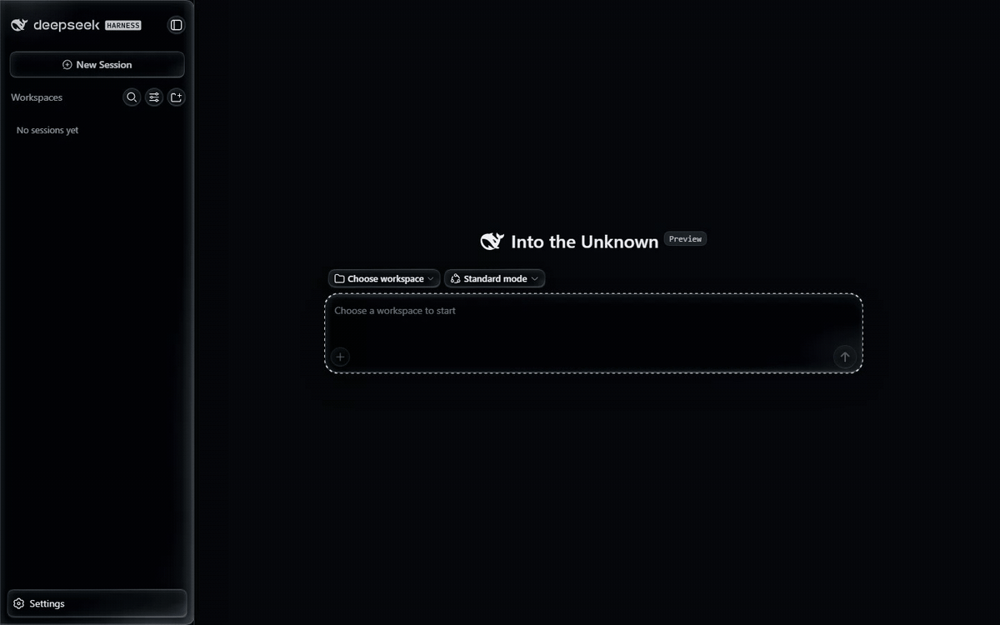

# Glass for DSH Web

[](https://github.com/wen-yifeng/dsh-client-ui-glass/releases/latest)
[](LICENSE)
[](#install)

English | [中文](README.zh.md)

A switchable dark-glassmorphism skin for the [DeepSeek Harness (DSH)](https://github.com/deepseek-ai/deepseek-harness) web client: frosted panels over a wallpaper stage, installed as a local DSH plugin. Toggle it any time; remove it and the stock UI comes back with no residue.



*Demo recorded at 2× speed from a fresh install (v0.3.19). The skin ships on; the switch, wallpaper, and blur live in **Settings → General → Glass mode**.*


## Highlights

- **Frosted dark glass over the whole UI** — ~60 design tokens are overridden through the host theme system, so every panel, dialog, and control picks up the glass finish.
- **Aura wallpaper stage** — nine built-in wallpapers behind the app (the frosted panels sample it through `backdrop-filter`), plus custom image upload with an optional blur.
- **One master switch** — lives in **Settings → General → Glass mode**, on by default. Turning it off (or removing the plugin) restores the stock UI with no leftover DOM, styles, or globals.
- **Settings hotkey** — a bare key press (default <kbd>Z</kbd>, rebindable) opens the settings dialog from anywhere.
- **State survives reloads** — the toggle and your wallpaper live in browser storage (IndexedDB) and are restored automatically.

| | | |
|---|---|---|
|  |  |  |
| Pure black stage | Gray paper | Mars |
|  |  |  |
| Mars · bright | Earth | Earth · close-up |
|  |  |  |
| Dune | Mountains | Lake reflection |


## Requirements

- A local [DSH](https://github.com/deepseek-ai/deepseek-harness) installation with its web client (tested against the 0.1.5 line — the profile directory `<dsh-root>/.dsh/profiles` must exist, which it does after the first launch).
- Windows PowerShell (built-in, no admin needed — the link uses a junction) or any POSIX shell on Linux/macOS.

## Install

The built plugin ships in this repository (`lib/` is prebuilt — no compilation needed).

**Step 1 — get the plugin.** Either clone this repo, or just download the installer script:

```powershell
git clone https://github.com/wen-yifeng/dsh-client-ui-glass.git
cd dsh-client-ui-glass
```

**Step 2 — run the installer** (point it at your dsh root; it can also download the release zip itself when not run from a clone):

```powershell
.\install.ps1 -DshRoot C:\path\to\dsh        # Windows
```
```bash
./install.sh /path/to/dsh                    # Linux / macOS
```

**Step 3 — restart DSH Web.** The skin turns on immediately; the switch (wallpaper, blur, hotkey) is in **Settings → General → Glass mode**.

Prefer doing it by hand? [Manual install](#manual-install) spells out the three things the script does.

## Manual install

The installer performs exactly three operations inside `<dsh-root>/.dsh`:

1. **Place the plugin** at `plugins/@deepseek-ai/dsh-client-ui-glass/` (clone or unzip there).
2. **Link it into the profile** so the plugin loader can resolve the package name — a junction/symlink from `profiles/node_modules/@deepseek-ai/dsh-client-ui-glass` to the plugins directory:

   ```powershell
   New-Item -ItemType Junction -Path '<dsh-root>\.dsh\profiles\node_modules\@deepseek-ai\dsh-client-ui-glass' -Target '<dsh-root>\.dsh\plugins\@deepseek-ai\dsh-client-ui-glass'
   ```

3. **Register the plugin** in the web profile's patch layer `<dsh-root>/.dsh/profiles/web/cordis.patch.yml` (create the file if it doesn't exist):

   ```yaml
   - insert:
       - id: ui-glass
         name: '@deepseek-ai/dsh-client-ui-glass'
   ```

## Uninstall

1. Delete the junction/symlink at `profiles/node_modules/@deepseek-ai/dsh-client-ui-glass`.
2. Delete the `plugins/@deepseek-ai/dsh-client-ui-glass/` directory.
3. Remove the `ui-glass` row from `profiles/web/cordis.patch.yml`.

Restart DSH Web — the stock UI is back, with no residual state on disk (browser-side wallpaper/toggle storage can be cleared from the Glass mode card).

## How it works

The plugin is a two-face cordis plugin. The node half registers a `ui-av-glass` settings namespace; the browser half owns the visuals: an alias-token override layer in the host theme stack, a global glass stylesheet keyed off `html[data-dsh-av-glass]`, and seam attributes stamped onto the stock DOM (idempotent, pre-paint, via one shared MutationObserver) so panels can be targeted without touching any host package. The wallpaper stage is a fixed layer behind the app; panel frosting samples it through `backdrop-filter`. While enabled the skin forces `color-scheme: dark` — the Appearance preference has no visible effect until you switch the skin off.

## Build from source

`src/` is a verbatim copy of the plugin package that now lives in the dsh monorepo (`packages/client/ui-glass` in [deepseek-harness](https://github.com/deepseek-ai/deepseek-harness)), where it builds with the monorepo toolchain. The committed `tsdown.config.mjs` documents the standalone build contract for the browser bundle (module-table factory artifact + lightningcss-inlined stylesheets), but rebuilding outside the monorepo requires the dsh build dependencies.

## License

[MIT](LICENSE)
