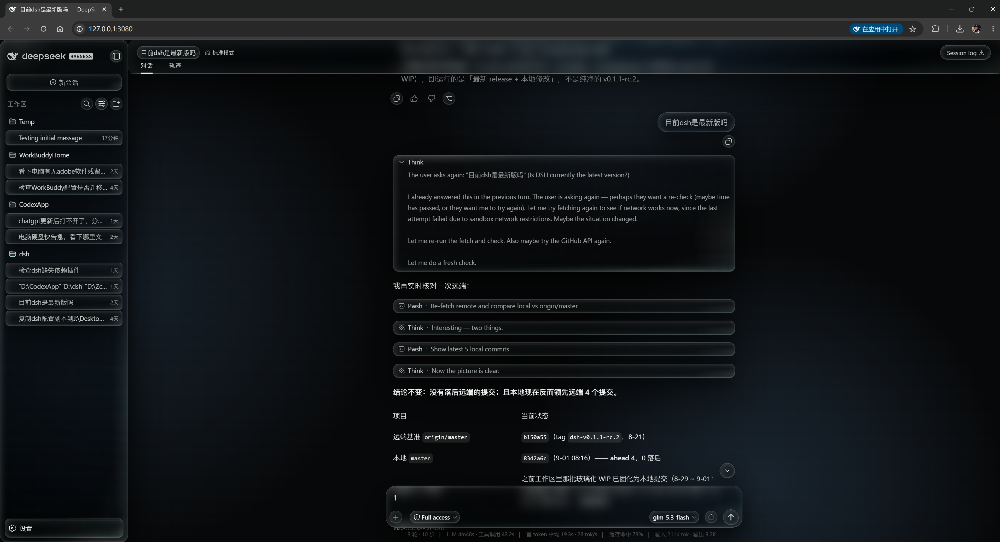
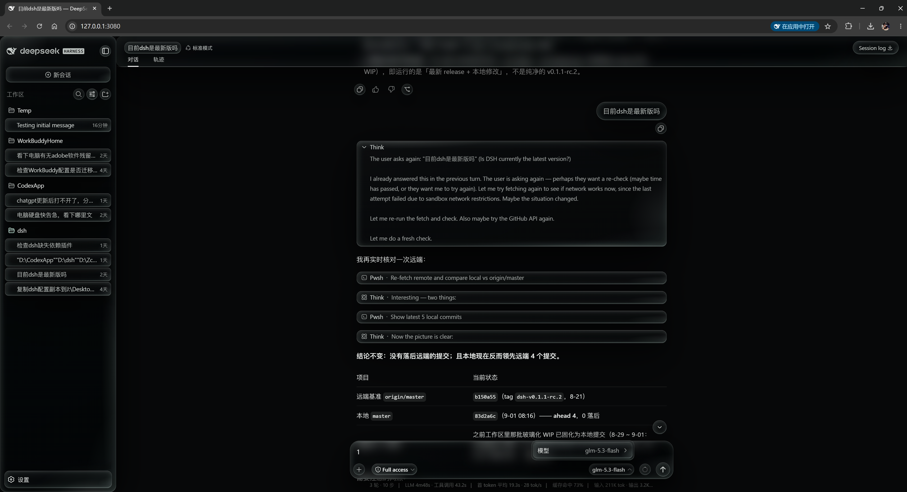
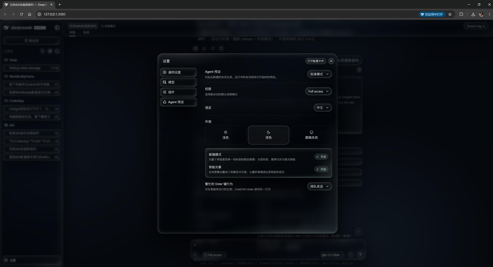
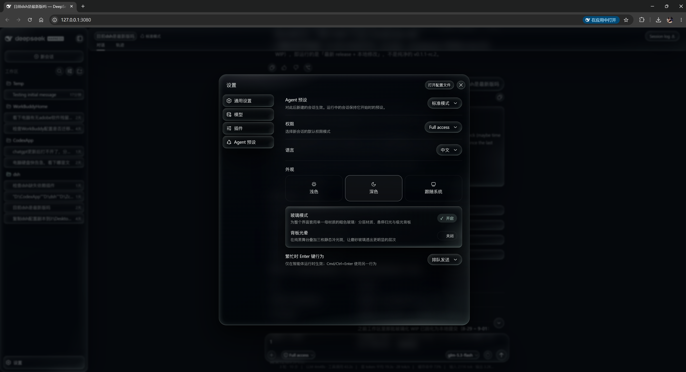

# @deepseek-ai/dsh-client-ui-glass

A self-contained, toggleable glass skin for the DSH Web client, ported from the Infinite Canvas single mother-material system (aurora stage, four depth layers, Tier A top-level interaction). The plugin is the single decision-maker: it works identically on stock DSH and on builds that consume its token contract.

## Screenshots






## How it decides the theme

- Mounting sets `data-dsh-av-glass` on `<html>`; every rule in its global sheet is prefixed with that attribute, so switching off (or uninstalling) restores the stock interface exactly.
- The sheet rewrites ~80 `--dsw-alias-*` palette tokens and covers global chrome rules (buttons, inputs, popovers, cards, tabs, scrollbars, selection, focus); all card-family selectors use exact-token matching so lookalike class names never get framed.
- Tier A top-level controls are stamped at runtime (`data-av-interaction="top"`) and get the hover specular sweep plus pointer-following spot; no idle animation, `prefers-reduced-motion` respected.
- Single dark palette: both appearances resolve to the canvas dark glass.

## Install (DSH local plugin)

```powershell
git clone <this repo> "<dsh-root>\.dsh\plugins\@deepseek-ai\dsh-client-ui-glass"
New-Item -ItemType Junction -Path '<dsh-root>\.dsh\profiles\node_modules\@deepseek-ai\dsh-client-ui-glass' -Target '<dsh-root>\.dsh\plugins\@deepseek-ai\dsh-client-ui-glass'
# Add to <dsh-root>\.dsh\profiles\web\cordis.patch.yml:
# - insert:
#     - id: ui-glass
#       name: '@deepseek-ai/dsh-client-ui-glass'
```

Restart DSH Web. Toggle in Settings > General > 玻璃模式 (Glass mode).

## Build

```sh
node <dsh-root>/node_modules/tsdown/dist/run.mjs   # from this directory
```
